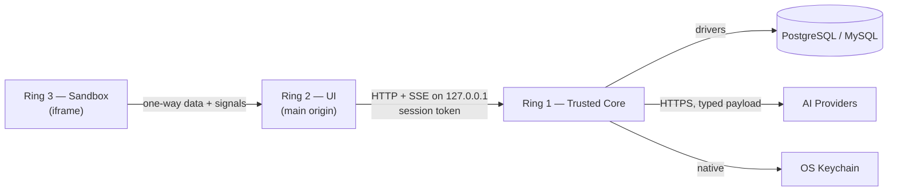
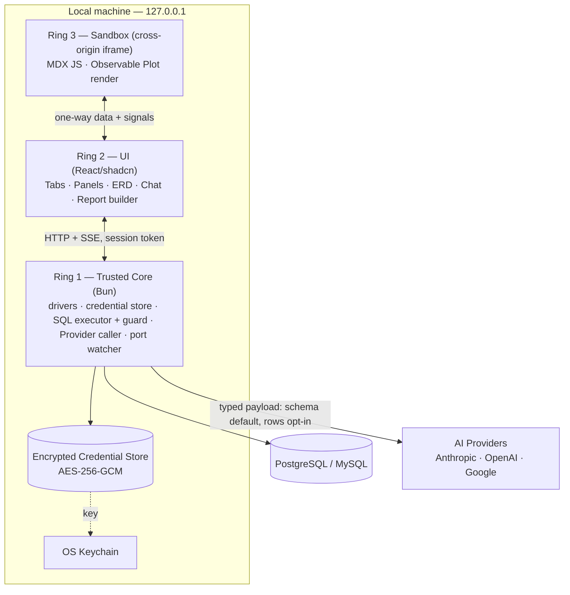
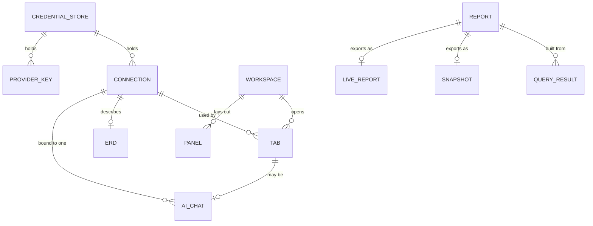

# Architecture Spine — quick-studio

## Design Paradigm

**Three-ring trust model** — a privilege-separated local web application. The whole product is organized as three concentric rings of decreasing trust, and the single load-bearing rule is that **data flows outward only; capability never flows inward**. Each ring's powers are fixed, and no feature may build a path that lets a less-trusted ring reach a more-trusted ring's resources.

| Ring | Process / origin | Holds | Directory |
| --- | --- | --- | --- |
| **1 — Trusted Core** | backend Bun process | DB connections, decrypted credentials, Provider API keys; the only SQL executor; the only Provider caller; destructive-statement guard; port-exposure watcher | `src/core/` |
| **2 — Semi-trusted UI** | main browser origin (React/shadcn) | open Tabs/Panels, chat orchestration; **no** direct DB/credential access — asks the Core over `127.0.0.1` with a session token | `src/ui/` |
| **3 — Untrusted Sandbox** | cross-origin iframe | LLM-generated MDX JavaScript; pure render only, fed one-way | `src/sandbox/` |

The Core is the trust anchor; the browser UI is an *authenticated* client of it; the Sandbox is quarantined guest code that can only draw. This paradigm is the product's security model — there is no user authentication in the account sense (single operator), but the Core still authenticates its caller (AD-12) because loopback alone is not a boundary. The ring boundary *is* the boundary that matters.

## Invariants & Rules

Dependency direction — an outer ring may **request from** the ring directly inside it (never skip inward, never reach outward for capability):



### AD-1 — Three-ring trust model is the root invariant

- **Binds:** all
- **Prevents:** any feature quietly building a path that lets less-trusted code reach DB connections, credentials, or Provider keys.
- **Rule:** every runtime unit belongs to exactly one ring (Core / UI / Sandbox). Data may be passed outward (Core→UI→Sandbox); capability and requests cross only to the ring immediately inward, via that boundary's defined, authenticated channel. No unit may widen its own ring's powers.

### AD-2 — The Trusted Core is the sole holder of secrets, the sole SQL executor, and the sole Provider caller

- **Binds:** FR-4, FR-7, FR-8, FR-9, FR-10, FR-11, FR-14, FR-15
- **Prevents:** a second code path to the database, credentials, or a Provider that escapes the Core's guards.
- **Rule:** DB connections, decrypted credentials, and Provider API keys exist **only** inside the Core process; **all** SQL executes there; and **every** outbound Provider call is made there. Ring 2 and Ring 3 never hold a credential, open a connection, run SQL, or call a Provider directly — they issue typed requests to the Core and receive results.

### AD-3 — The Sandbox is a cross-origin iframe, pure-render, fed one-way

- **Binds:** FR-17, R1
- **Prevents:** LLM-generated JavaScript reaching the host, filesystem, network, backend, credentials, or database — and laundering a data/query request inward.
- **Rule:** MDX-embedded JS runs in an iframe served from a **separate origin**, with `sandbox="allow-scripts"` and **without** `allow-same-origin`, under CSP `default-src 'none'` (and `connect-src 'none'`). The `postMessage` channel is **one-way for data**: Ring 2 pushes already-frozen data *into* the sandbox; the sandbox emits *out* only render-lifecycle and user-interaction signals (ready, height, datum-clicked). The sandbox **cannot request data or trigger a query** — any refresh or re-query is owned and initiated by Ring 2. In-process isolation (SES, QuickJS-WASM, ShadowRealm) is **never** the trust boundary; only the cross-origin process boundary is.

### AD-4 — One Core executor gates every mutation; confirmation policy is set by request *shape*, not by ring

- **Binds:** FR-8, FR-9, FR-11, FR-15, R4
- **Prevents:** an AI-generated or chat-issued statement bypassing the destructive-statement guard, a benign SELECT smuggling a destructive tail, **and** — the inverse failure — a fast inline data-grid edit being buried under a confirmation prompt on every commit.
- **Rule:** every database mutation, without exception, executes through the single Core executor — the **sole** classifier of statement risk; a Ring-2 confirmation dialog is UX only, never the gate. The executor accepts requests in exactly **two shapes** and sets its confirmation policy by shape:
  - **(a) Structured operations** — typed, parameterized requests from UI builders: single-row data-grid DML (one table, one **primary-key-addressed** row, column/value pairs) and the create-table builder. The Core composes the parameterized statement itself; the request carries **no raw SQL, no multiple statements, and no arbitrary DDL**. This path can express **only** a single-row `INSERT` / `UPDATE` / `DELETE` addressed by primary key, or a `CREATE TABLE` — never `DROP`, `TRUNCATE`, `ALTER`, a raw or multi-row mutation, or multiple statements. **Confirmation policy:** `INSERT`, single-row `UPDATE`, and `CREATE TABLE` **auto-commit** (the grid/builder *is* the confirmation surface); a row **`DELETE` always requires explicit confirmation** (destructive, not trivially reversible).
  - **(b) Raw SQL text** — from the query Tab or an AI-generated query, classified as opaque text. Any mutating statement (**`UPDATE`, `DELETE`, `DROP`, `TRUNCATE`, `ALTER`**) is **default-deny: never auto-run, always requiring explicit confirmation.** Multi-statement input is rejected or split so no destructive statement rides behind a safe one. `DROP` / `TRUNCATE` / `ALTER` and any raw or multi-row mutation can arrive **only** on this path — never on path (a).

  The invariant is unchanged: all mutation still flows through the one Core executor and is always parameterized. Only the *confirmation policy* is differentiated — by the request's structural shape, which the Core can tell apart because the two paths arrive as distinct typed shapes (never by parsing intent).

### AD-5 — Credential Store is encrypted at rest; key in OS keychain; passphrase fallback; never plaintext

- **Binds:** FR-4, FR-5, FR-6, FR-14, R2
- **Prevents:** plaintext credential exposure, and a keychain-less platform forcing an insecure store.
- **Rule:** Persistent-mode secrets (Connections + Provider keys) live in an AES-256-GCM file; the 32-byte key is held in the OS keychain (Windows Credential Manager / Linux Secret Service). Where no keychain is available, a passphrase-derived key unlocks the store. Plaintext is never written — not even as a fallback. Ephemeral-mode keys are session-only, in memory.

### AD-6 — Localhost by default; active exposure watcher

- **Binds:** FR-21, FR-22, R3
- **Prevents:** the server becoming reachable off-machine without the operator knowing.
- **Rule:** the server binds `127.0.0.1` unless explicitly overridden. A watcher detects any non-loopback binding and raises a prominent Port-Exposure Warning that explains the risk and how to revert.

### AD-7 — The Core owns the Provider boundary via a typed, inspectable payload; schema-only default

- **Binds:** FR-15, FR-17, R5, R6
- **Prevents:** silent exfiltration of real data, row data laundered inside Ring-2 free text, and two chat surfaces disagreeing on what leaves the machine.
- **Rule:** the **only** outbound channel from the machine is the user-configured Provider, and the Core (holder of Provider keys, AD-2) makes the call. The request is assembled as a **typed, Core-inspectable structure** with schema metadata and any row sample as **distinct fields** — never opaque Ring-2 free text — so the Core enforces the **schema-only default** (table/column names, types, foreign keys) and can verify no rows ride along except through an explicit, **per-query**, visibly-indicated opt-in. quick-studio runs entirely on the user's own Provider keys: no backend account, no hosted inference cost (R6).

### AD-8 — Ephemeral mode writes nothing to disk

- **Binds:** FR-2, FR-3
- **Prevents:** a zero-footprint session leaking artifacts to disk.
- **Rule:** in Ephemeral mode nothing is persisted — no Credential Store, no ERD layout, no Report, no panel state. All session state is in-memory and gone at exit; no daemon outlives the process.

### AD-9 — A Live Report carries no credential and re-queries only through a running, authorizing quick-studio

- **Binds:** FR-19, FR-20
- **Prevents:** loose credentials or an embedded DB runtime escaping into an exported HTML file.
- **Rule:** a **Snapshot** embeds frozen data and renders fully offline. A **Live Report** contains no credential and no DB runtime; it re-queries only by targeting a running quick-studio Core on `127.0.0.1`, which **explicitly authorizes** it as a caller (AD-12) and supplies the connection (viewer-supplied, per the PRD). Re-targeting re-runs the Report's queries via the Core without rebuilding its layout.

### AD-10 — Charting is split by ring

- **Binds:** FR-17, FR-18
- **Prevents:** assuming one chart library works in both the React app and the React-less sandbox.
- **Rule:** in-app charts (Ring 2) use Recharts / shadcn charts; charts inside the Sandbox (Ring 3, which has no React host) use Observable Plot (framework-agnostic). TradingView lightweight-charts is not used (financial-OHLC focus, wrong fit for generic DB data).

### AD-11 — Streaming is SSE; reasoning is a distinct channel from the answer

- **Binds:** FR-16, NFR-6
- **Prevents:** blocking, all-at-once AI output, and reasoning bleeding into the final answer.
- **Rule:** Core→UI streaming (AI tokens and reasoning, large result pages) uses SSE over the localhost HTTP channel. Model reasoning is transported and rendered as a channel visually distinct from the final answer.

### AD-12 — The Core authenticates every caller (session capability token + anti-rebinding)

- **Binds:** FR-2, FR-21, FR-22, R3
- **Prevents:** any local web page or DNS-rebinding attack POSTing SQL to the loopback Core — loopback is not an authentication boundary.
- **Rule:** the Core rejects every RPC that does not carry the current session's capability token, and validates the `Origin`/`Host` headers to block DNS-rebinding. The browser UI is handed the token at boot over the local channel. A Live Report is authorized only as an **explicit** second caller (AD-9), never implicitly by virtue of hitting the loopback port.

### AD-13 — One canonical frozen-data shape across every boundary

- **Binds:** FR-17, FR-18, FR-20
- **Prevents:** the Snapshot path, the Live path, and two MDX blocks each assuming a different shape or date encoding for "frozen data."
- **Rule:** a single shared, versioned frozen-data schema (defined in `shared/`) is the only shape pushed to the Sandbox and the only shape embedded in a Snapshot. The wire conventions (ISO-8601 UTC dates, typed values) bind the UI↔Sandbox boundary exactly as they bind Core RPC — never live JS `Date` objects in one path and ISO strings in the other. Milliseconds are the frozen-date model's canonical precision (DW-6): at the frozen-data `encode`/`decode` boundary an over-precise instant is floored to 3 fractional digits — the truncation never moves the instant forward in time (it floors, so a pre-epoch instant floors away from zero) — while the standalone `assertIsoUtc` invariant stays exported and strict, still rejecting a 4+-digit fractional field as non-canonical.

### AD-14 — Engine-dialect isolation lives inside the Core

- **Binds:** FR-7, FR-9, FR-10, FR-11, FR-12, NFR-5
- **Prevents:** two features hard-coding divergent PostgreSQL vs MySQL SQL or introspection assumptions.
- **Rule:** all engine-specific SQL, schema introspection, and result pagination live **only** in the Core behind one uniform driver interface; Ring 2 and Ring 3 see a single engine-neutral shape. The Core owns pagination/virtualization windows for large results and never ships a whole live result set.

### AD-15 — Persistent state lives under one OS-convention app directory

- **Binds:** FR-4, FR-6, FR-13, FR-24
- **Prevents:** Persistent-mode files scattering across the filesystem and breaking the lightweight-footprint promise.
- **Rule:** in Persistent mode the Credential Store, ERD layouts, Reports, panel/session state, and any logs live under a single OS-convention app-data directory (Windows `%APPDATA%\quick-studio`; Linux `$XDG_DATA_HOME/quick-studio`, else `~/.local/share/quick-studio`). Ephemeral mode writes nothing (AD-8).

### AD-16 — Dual distribution: standalone binary and runtime package

- **Binds:** FR-1, FR-2
- **Prevents:** a colleague without a JS runtime being unable to install.
- **Rule:** quick-studio ships two install paths that yield the same one-command run: a standalone `bun build --compile` binary per platform (Windows + Linux) via releases — the headline "one command, no runtime installed" path — and an npm/bun global package for developers who already have a runtime.

## Performance Budgets

Load-bearing acceptance criteria, not aspirations (PRD §10) — "lightweight/fast" is the identity. Concrete numbers are cold-start targets to hold and refine against real measurement.

| Budget | Target | Ref |
| --- | --- | --- |
| Idle resident memory (connections open) | ≤ ~200 MB accepted ceiling; Bun idle ~35–45 MB leaves wide headroom | NFR-1 |
| Cold start → interactive Workspace | ≤ 2 s | NFR-2 |
| Shutdown | instant, non-blocking; no orphan process or lingering daemon | NFR-3 (AD-8) |
| UI interaction (open table, switch Tab, resize Panel) | < 100 ms; first result paint bounded by the DB, not the tool | NFR-4 |
| Large results / ERD | stay responsive via Core pagination/virtualization; ERD fluid to 60–70 tables | NFR-5 (AD-14) |
| AI streaming + MDX render | never janks the UI thread | NFR-6 (AD-11) |

## Consistency Conventions

| Concern | Convention |
| --- | --- |
| Ring naming | source lives under `core/`, `ui/`, `sandbox/`; a shared, dependency-free `shared/` holds only types and the RPC + frozen-data contracts |
| Files & symbols | modules kebab-case; React components PascalCase; the Core↔UI and UI↔Sandbox contracts are typed in `shared/` and imported by both sides |
| DB identifiers | table/column names mirror the live database verbatim — never renamed or normalized in the schema/ERD layer |
| Wire formats | dates ISO-8601 UTC on every boundary (Core↔UI **and** UI↔Sandbox); every Core RPC reply is a typed result or a single error envelope `code / message / detail`; large results are paginated/virtualized (AD-14), never sent whole |
| State & mutation | all DB mutation flows through the Core executor (AD-4); UI/session state (Tabs, Panels, ERD layout) is Ring-2 state, persisted only in Persistent mode under the AD-15 directory |
| Secrets & logging | secrets are never logged; logging is minimal and to stderr, off or terse by default (footprint is the identity); the store file never contains its own key |
| Auth | no user accounts (single operator), but the Core authenticates its caller via the AD-12 session token; the ring boundary is the security model |
| Config | run mode and overrides via CLI flags (Ephemeral = a DB URL; Persistent = default/flag), plus an optional config file in Persistent mode |
| Aesthetic | shadcn/ui, **dark-first**; motion serves feedback (state changes, streaming), never decoration — consistent with the lightweight identity (PRD §12) |

## Stack

Seed. The load-bearing libraries are verified current at authoring (2026-07-06) against their registries; the language/UI-framework majors (React, TypeScript, shadcn) are cold-start seed to confirm exact versions at scaffold. The code owns exact patches once it exists. Provider SDKs are reached through the unified AI layer, not called directly.

| Name | Version |
| --- | --- |
| Bun (runtime + `bun build --compile`) | 1.2.x |
| TypeScript | 5.x |
| React + shadcn/ui | React 19.x |
| Vercel AI SDK (`ai` + `@ai-sdk/anthropic` / `openai` / `google`) | ai 7.0.15 / adapters 4.0.8 |
| postgres.js (PostgreSQL) | 3.x |
| mysql2 (MySQL) | 3.22.5 |
| @napi-rs/keyring (OS keychain) | 1.3.0 |
| Recharts (in-app charts) | 3.9.2 |
| Observable Plot (sandbox charts) | 0.6.17 |

## Structural Seed

Container / context view — the three rings, the databases they read, and the only outbound edge:



Core entities (names + relationships only; attribute-level rules live in the ADs):



Minimal source tree — scaffold, not a mirror to maintain:

```text
quick-studio/
  src/
    core/       # Ring 1: server, DB drivers, credential store, SQL executor + guard, Provider caller, port watcher, auth
    ui/         # Ring 2: React/shadcn app, Tabs/Panels, ERD, chat, report builder
    sandbox/    # Ring 3: cross-origin iframe host, MDX runtime, Observable Plot render
    shared/     # dependency-free: typed RPC + frozen-data contracts, shared types (imported by all rings)
  bin/          # CLI entry: parse mode (Ephemeral URL / Persistent), boot Core, open browser
```

## Capability → Architecture Map

| Capability / Area | Lives in | Governed by |
| --- | --- | --- |
| Install & launch, run modes, clean shutdown (FR-1–3) | `bin/`, `core/` | AD-8, AD-16, NFR-2/3 |
| Credential Store & Connections (FR-4–7) | `core/` | AD-2, AD-5, AD-14, AD-15 |
| Data & schema workspace (FR-8–11) | `ui/` → `core/` | AD-2, AD-4, AD-14 |
| Interactive ERD (FR-12–13) | `ui/`, persisted via `core/` | AD-2, AD-14, AD-15 |
| AI Chat: providers, NL→query, streaming, MDX (FR-14–17) | `core/` (call+exec), `ui/`, `sandbox/` | AD-2, AD-3, AD-7, AD-11, AD-13 |
| Report generation (FR-18–20) | `ui/` (build), `core/` (query), `sandbox/` (render) | AD-3, AD-9, AD-10, AD-12, AD-13 |
| Local security & port exposure (FR-21–22) | `core/` | AD-6, AD-12 |
| UI shell: Tabs, Panels (FR-23–24) | `ui/` | AD-8, AD-15 |
| Footprint & responsiveness (NFR-1–6) | all rings | Performance Budgets, AD-11, AD-14 |
| Cost / no-account (R6) | `core/` | AD-7 |

## Deferred

- **NoSQL engines (MongoDB, DynamoDB)** — v2; different paradigm, own UX pass (PRD §6.2). Emotionally load-bearing to the builder; revisit right after v1.
- **Deep visual ERD editing** (schema changes *through* the diagram) — v2; v1 views/navigates only.
- **Auto-update / version-delivery mechanism** for distributed binaries — v1 ships re-install/re-download (AD-16); a self-update path is later.
- **macOS support** — out for v1 (Windows + Linux only).
- **Runtime keychain validation** — smoke-test `@napi-rs/keyring` under Bun on Windows and Linux before locking; the passphrase fallback (AD-5) is the safety net if a platform fails.
- **Data-volume ceilings** (PRD Open Q5) — concrete limits for result-grid size, ERD table count (fluid target 60–70 tables), and report data size; refine the Performance Budgets against measurement — owned by the code.
- **Exact MDX runtime + provider-model defaults** — library choice and default model per Provider are code-level, within AD-3/AD-7/AD-11/AD-13.
- **Framework-major confirmation** — pin exact React/TypeScript/shadcn versions at scaffold (Stack note).
- **Positioning-freshness re-check** (PRD Open Q6) — non-architectural; re-verify competitive claims before public positioning.
